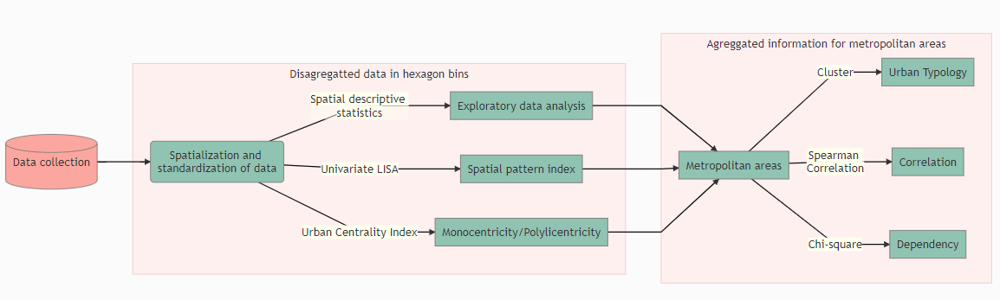
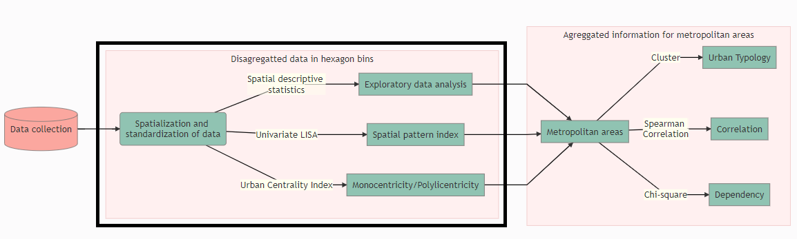
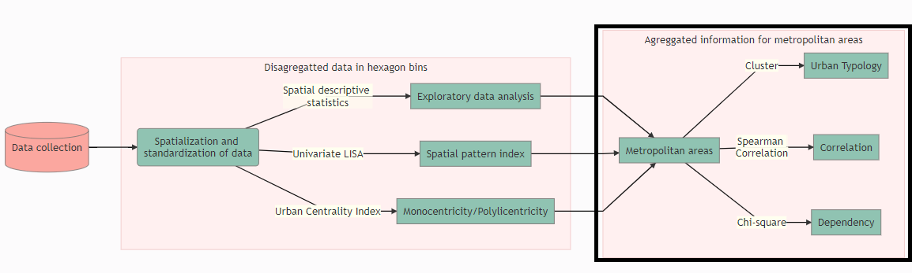
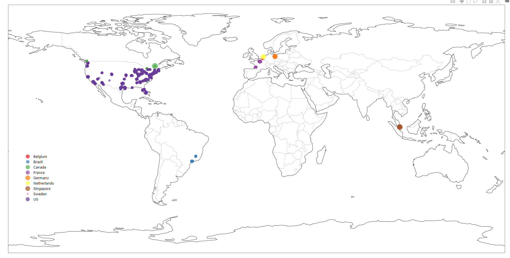
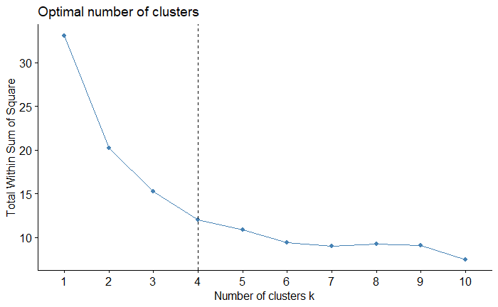
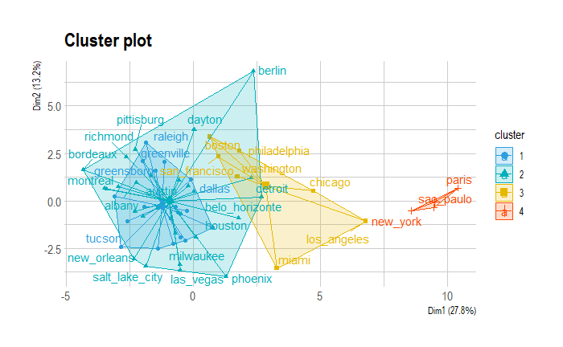
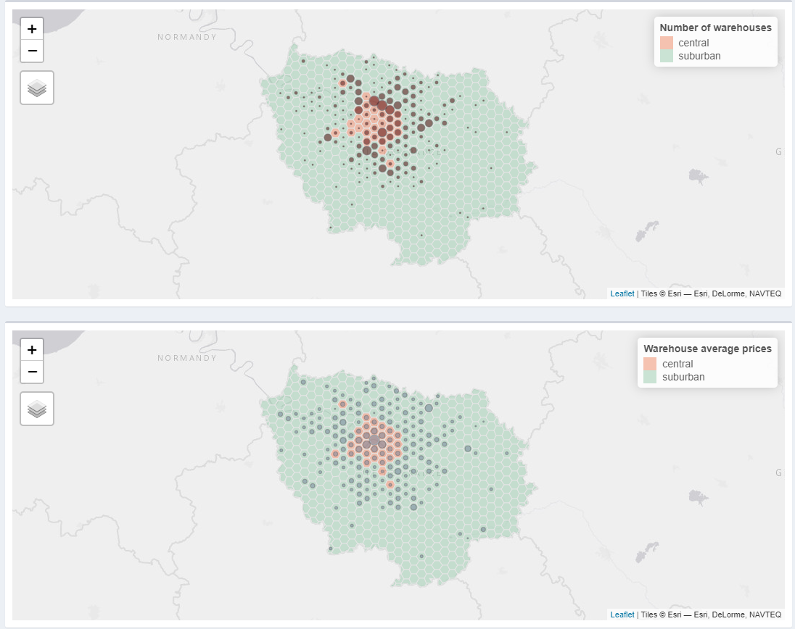
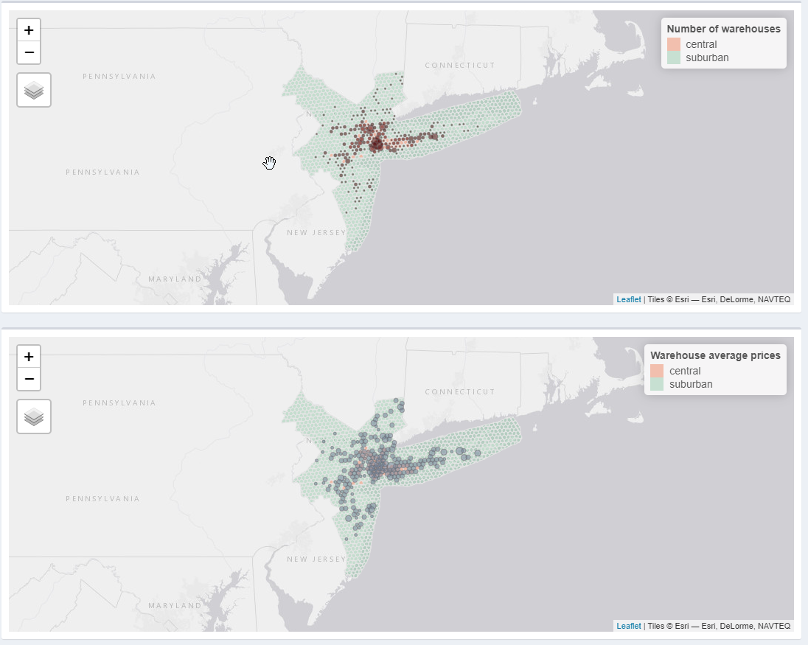

```{r setup, include=FALSE}
knitr::opts_chunk$set(warning = FALSE, message = FALSE)
# options(knitr.table.format = "html")
library(tidyverse)
library(fontawesome) # from github: https://github.com/rstudio/fontawesome
library(plotly)
```


layout: true
  
<div class="my-footer"><span>retaoliveira.github.io/places</span></div>

<!-- this adds the link footer to all slides, depends on my-footer class in css-->

---
name: xaringan-title
class: left, middle
background-image: url(img/log7.jpg)
background-size: cover

.beige[
.larger[
Relationships among urban characteristics, real estate market and spatial patterns of warehouses in different geographic contexts
]
]

.beige[
Renata Oliveira | Splott/UGE seminar | 10/05/2021
]


<!-- this ends up being the title slide since seal = FALSE-->

---

# Authors

```{r echo=FALSE, fig.align='center', message=FALSE, warning=FALSE, out.width='90%'}

```

.center[
.large[
Renata Oliveira under supervision of Laetitia Dablanc and Matthieu Schorung   

]
]

---

# Research Hypothesis
(Dablanc, L., 2019)
.large[
**Logistics sprawl is higher** in cities with a **high differential** between **central and suburban land/rent values**.
]


<hr>
--

.large[
The **location of warehouses** is closely related to **land/rent values** of logistics facilities.
]


---


# Objectives


**Chair Logistics City Theme 1 objective: **Compare spatial patterns of warehouses overtime and in different cities around the world connecting urban form to the evolution in the number and location of logistics facilities**
(Dablanc, L., Palacios, L., 2019)

<hr>
--


Focus of this research: Identify **the relationships between urban attributes, logistics real estate, and logistics facilities' spatial structure focusing on logistics sprawl**


---

# Methodological approach 

```{r echo=FALSE, message=FALSE, warning=FALSE}

```

---

# Methodological approach 

```{r echo=FALSE, message=FALSE, warning=FALSE}

```

---

# Methodological approach
**Spatial descriptive statistics**

.pull-left[
.small[
Urban Classification

Classification|	Category
--------------|---------
Lower outlier	|Suburban
< 95 %|	Suburban
>= 5 %	| Central
Upper outlier	| Central
]
]

.pull-right[

.small[
Warehouse location and rent prices

Classification|	Category
--------------|---------
Lower extreme|	Extremely low
Lower outlier|	Very low
< 25 %|Low
25 % - 50 %|	Medium
50 % - 75%|	Medium
> 75 %	|High
Upper outlier|	 Very high
Upper extreme	|Extremely high
]
]


---

# Methodological approach 
**Spatial pattern index**

**Univariate Global and Local Moran's I** - spatial autocorrelation. 

LISA map generated considering a 0.05 level of significance and a Monte Carlo simulation (2000 permutations).  

---

# Methodological approach 

**Urban Centrality Index (UCI)***

Computed considering: 
- **location coefficient** - measure the unequal distribution factor of the urban intensity index within each urban area
- **spatial separation index**, namely Venables index, which aims at evaluating the spatial distribution of spatial patterns of activities; and
- **proximity index**, which is the normalization of the Venables index considering the respective maximum attainable value. The UCI values range from 0 to 1, where 0 the most polycentric area and 1, maximal monocentricity. 

.pull-right-narrow[
.small[
*Pereira (2013)
]
]

---

# Methodological approach 

**Dataset containing all hex bins for all the metropolitan regions investigated**
.midi[
-	Number of warehouses in each hex bin
-	Average warehouse price in each hex bin
-	Urban intensity index
-	Spatial cluster identification for urban intensity index and warehouse count and rent prices
-	Classification and outlier’s identification for warehouse count and rent prices
]


---

# Methodological approach 


```{r echo=FALSE, message=FALSE, warning=FALSE, out.width="200%"}

```

---

# Methodological approach 

**Dataset containing the summary indicators for each metropolitan region**
.midi[
-	Global Moran’s I index for urban activity index
-	Global Moran’s I index for warehouse spatial distribution
-	Global Moran’s I index for warehouse rent prices distribution
-	UCI for urban activity index
-	UCI for warehouse location
- Price differential for central and suburban warehouses
-	Population (t0 and t1) (Dablanc, L; Palacios, L., 2019)
-	Metropolitan territorial area (Dablanc, L; Palacios, L., 2019)
-	Number of municipalities (Dablanc, L; Palacios, L., 2019)
-	Number of warehouses (t0 and t1) (Dablanc, L; Palacios, L., 2019)
-	Average distance to barycenter (t0 and t1) (Dablanc, L; Palacios, L., 2019)
-	Yearly logistics sprawl (Dablanc, L; Palacios, L., 2019)
-	The proportion of HH, HL, LH and LL clusters for the urban activity index, warehouse location and warehouse price.
]

---

# Methodological approach 

**Typology** - K-means cluster analysis

.center[
.green[
Can we gather all metropolitan regions into one comparative analysis?
]
]

**Dependency** of warehouse location and prices on urban activity - Chi-square independent

.center[
.green[
Do warehouse location and prices depend on urban activity?
]
]

**Correlation** among continuous variables - Spearman correlation

.center[
.green[
Is logistics sprawl related to warehouse rental prices? 
]
]

---


```{r echo=FALSE, message=FALSE, warning=FALSE, out.width="120%", fig.align='center'}

```

---


```{r echo=FALSE, fig.align='center', message=FALSE, warning=FALSE, out.height="100%", out.width="105%"}
library(plotly)
load("D:/google_drive/01_postdoc/08_review/scripts/data/img/espraia.rda")
espraia
```

---


```{r echo=FALSE, fig.align='center', message=FALSE, warning=FALSE, out.height="100%", out.width="105%"}
library(plotly)
load("D:/google_drive/01_postdoc/08_review/scripts/data/img/diff_quad1.rda")
fig_quad1
```


---
```{r echo=FALSE, fig.align='center', message=FALSE, warning=FALSE, out.height="100%", out.width="100%"}
library(plotly)
load("D:/google_drive/01_postdoc/08_review/scripts/data/img/quad2.rda")
figb

```

---

```{r echo=FALSE, fig.align='center', message=FALSE, warning=FALSE, out.height="100%", out.width="105%"}
library(plotly)
load("D:/google_drive/01_postdoc/08_review/scripts/data/img/diff_quad2.rda")
figc
```
---


# Results - to be reviewed

.pull-left-narrow[
```{r echo=FALSE, message=FALSE, warning=FALSE, out.width="120%", fig.align='center'}

```

Assumption:   
FOUR CLUSTERS

]

.pull-right-wide[
```{r echo=FALSE, message=FALSE, warning=FALSE, out.width="150%", fig.align='center'}

```
]

---

# Results
Metropolitan areas for comparison - **To be reviewed from cluster analysis**

.pull-left[
.small[
- albany
- atlanta
- austin
- belo_horizonte
- berlin
- bordeaux
- boston
- buffalo
- charlotte
- columbus
- grand_rapids
- kansas_city
- las_vegas
]
]

.small[
.pull-right[
- los_angeles
- miami
- milwaukee
- montreal
- nashville
- new_york
- paris
- pittisburg
- raleigh
- salt_lake_city
- san_francisco
- sao_paulo
- toronto
- vancouver
- washington
]
]

---
# Examples of the representation
Referential for the urban classification

.pull-left[
```{r echo=FALSE, message=FALSE, warning=FALSE, out.width="120%", fig.align='center'}

```
]

.pull-right[
```{r echo=FALSE, message=FALSE, warning=FALSE, out.width="120%", fig.align='center'}

```
]


---

# Futher steps

- Conclude classification of metropolitan areas
- Compare different classes of metropolitan areas - sprawl x urban attributes - **scale regarding the comparison between European and North American metros**
- [Dashboard](https://geodatascience.shinyapps.io/logistics_city_chair/)
- Paper


---

# Research contributions


**Methodological:** innovative framework for comparing metropolitan regions considering the spatial pattern of logistics facilities and urban characteristics. 

**Reproducibility**

**Public Policy:** Can induce local and regional public authorities to develop more effective public policy addressed to logistics land use and transportation planning. Coordinating these dimensions is essential to support urban logistics stakeholders' needs, cities' livability, and the real estate market.


---

# References

.tiny[
  
[1]	L. Dablanc, D. Rakotonarivo, The impacts of logistics sprawl: How does the location of parcel transport terminals affect the energy efficiency of goods’ movements in Paris and what can we do about it?, Procedia - Soc. Behav. Sci. 2 (2010) 6087–6096. https://doi.org/10.1016/j.sbspro.2010.04.021.
[2]	L. Dablanc, S. Ogilvie, A. Goodchild, Logistics sprawl, Transp. Res. Rec. 2410 (2014) 105–112. https://doi.org/10.3141/2410-12.   
[3]	L. Dablanc, M. Browne, Introduction to special section on logistics sprawl, J. Transp. Geogr. (2019) 0–1.    https://doi.org/10.1016/j.jtrangeo.2019.01.010.   
[4]	A. Heitz, L. Dablanc, L.A. Tavasszy, Logistics sprawl in monocentric and polycentric metropolitan areas: the cases of Paris, France, and the Randstad, the Netherlands, REGION. 4 (2017) 93. https://doi.org/10.18335/region.v4i1.158.   
[5]	J. Cidell, Concentration and decentralization: The new geography of freight distribution in US metropolitan areas, J. Transp. Geogr. 18 (2010) 363–371. https://doi.org/10.1016/j.jtrangeo.2009.06.017.   
[6]	T. Sakai, A. Beziat, A. Heitz, Location factors for logistics facilities: Location choice modeling considering activity categories, J. Transp. Geogr. 85 (2020) 102710. https://doi.org/10.1016/j.jtrangeo.2020.102710.   
[7]	OpenStreetMap contributors, Planet dump retrieved from https://planet.osm.org , (2017).   
[8]	S. Shekhar, H. Xiong, Local Indicators of Spatial Association Statistics, Encycl. GIS. 116 (2008) 615–615. https://doi.org/10.1007/978-0-387-35973-1_701.   
[9]	A. Luc, Spatial econometrics: methods and models, Kluwer Academic., Dordrecht, 1988.   
[10]	R.H.M. Pereira, V. Nadalin, L. Monasterio, P.H.M. Albuquerque, Urban Centrality: A Simple Index, Geogr. Anal. 45 (2013) 77–89. https://doi.org/10.1111/gean.12002.   
[11]	A. Regal, J. Gonzalez-Feliu, M. Rodriguez, M. Juganaru-Mathieu, Defining urban logistics profile zones in South American metropolis by combining functional and spatial clustering techniques, 2019 Int. Conf. Control. Autom. Diagnosis, ICCAD 2019 - Proc. (2019) 1–6. https://doi.org/10.1109/ICCAD46983.2019.9037890.   
[12]	Y. Wang, C. Hao, D. Liu, The spatial and temporal dimensions of the interdependence between the airline industry and the Chinese economy, J. Transp. Geogr. 74 (2019) 201–210. https://doi.org/10.1016/j.jtrangeo.2018.11.020.   
]


---


class: right, middle, inverse


# Find me at...

[`r fa(name = "twitter")` @retaoliveira](http://twitter.com/retaoliveira)  
[`r fa(name = "github")` @retaoliveira](http://github.com/retaoliveira)  
[`r fa(name = "link")` retaoliveira.github.io/places](https://retaoliveira.github.io/places)  
[`r fa(name = "paper-plane")` renataoliveira@cefetmg.br](mailto:renataoliveira@cefetmg.br)


